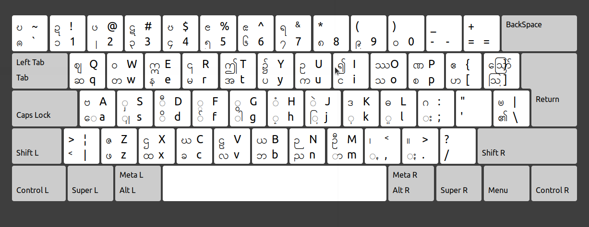

# PaOh Keyboard for Ubuntu

Ubuntu အတွက်ပအိုဝ်းစာရေးလို့ရမယ့် လက်ကွက်လေးဖြစ်ပါတယ်။
ဥဘွန်းတုမှာအသင့်ပါလာတဲ့ မြန်မာလက်ကွက်ကို မုဲင်ꩻငါ ( ꩻ ) နှင့် မုဲင်ꩻပတ်ငါ ( ႏ ) ဖြည့်စွတ်လိုက်ခြင်းသာဖြစ်ပါတယ်။

# အလိုအလျောက်ထည့်သွင်းနည်း
 Terminal ကိုဖွင့်ပြီး အောက်ပါကုဒ်တွေကို တစ်ကြောင်းခြင်း Copy ကူးထည့်ပြီး Enter နှိပ်ရုံပါ။

    git clone https://github.com/KhunHtetzNaing/Ubuntu-PaOh-Keyboard
    cd Ubuntu-PaOh-Keyboard
    make install

 ပြီးရင် Log out သို့မဟုတ် ကွန်ပျူတာကိုပိတ်ပြီးပြန်ဖွင့်ရန်လိုပါသည်။
 ပြန်ဖြုတ်လိုလျှင်

     make uninstall 

 ဟု ရိုက်ပြီး Enter နှိပ်ပါ။
##  မိမိဘာသာထည့်သွင်းခြင်း

> ဒီနည်းလမ်းကိုသာမန်အသုံးပြုသူများအတွက် အကြံမပြုလိုပါ။

**pao** ဖိုင်ကိုကူးပြီး **/usr/share/X11/xkb/symbols/** အောက်မှာသွားထည့်ပေးပါ။
**/usr/share/X11/xkb/rules/evdev.xml** ဖိုင်ကိုဖွင့်ပါ။
</layoutList> ကိုရှာပြီးအောက်ပါကုဒ်တွေနဲ့ အစားထိုးပေးပါ။

    <layout>
    <configItem>
    <name>pao</name>
    <!-- Keyboard indicator for PaOh (Pa-O, Pa'O, Black Karen) layouts -->
    <shortDescription>paoh</shortDescription>
    <description>PaOh</description>
    <languageList>
    <iso639Id>blk</iso639Id>
    </languageList>
    </configItem>
    </layout>
    </layoutList>

Ref: https://askubuntu.com/questions/510024/what-are-the-steps-needed-to-create-new-keyboard-layout-on-ubuntu

